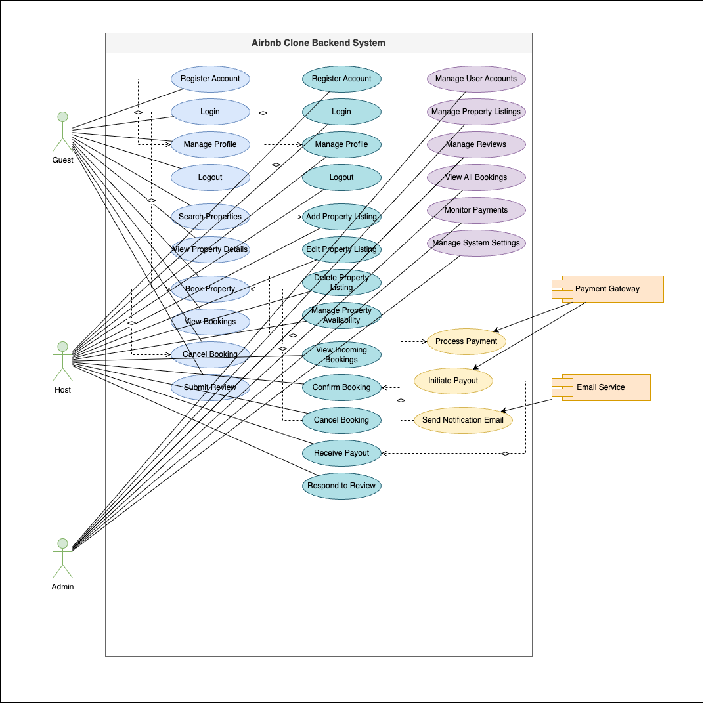

# Airbnb Clone Backend - Use Case Diagram

## Diagram

Below is the generated Use Case Diagram:

## Key Components of the Diagram

### 1. System Boundary

The large rectangle encapsulates all the Use Cases, representing the "Airbnb Clone Backend System" itself. This clearly defines what functionalities are part of the system.

### 2. Actors

These are the primary external entities that interact with the system.

- **Guest**
- **Host:**
- **Admin:**
- **Payment Gateway (System)**
- **Email Service (System)**

### 3. Use Cases

These are the specific functionalities or services that the system provides. They are grouped logically for clarity.

#### For Guest:

- **User Account Management:** Register Account, Login, Manage Profile, Logout.
- **Property Search & View:** Search Properties, View Property Details.
- **Booking Management:** Book Property, View Bookings, Cancel Booking.
- **Reviews & Ratings:** Submit Review.

#### For Host:

- **User Account Management:** Register Account, Login, Manage Profile, Logout.
- **Property Listing Management:** Add Property Listing, Edit Property Listing, Delete Property Listing, Manage Property Availability.
- **Booking Management:** View Incoming Bookings, Confirm Booking, Cancel Booking.
- **Payout Management:** Receive Payout.
- **Reviews & Ratings:** Respond to Review.

#### For Admin:

- **User Management:** Manage User Accounts.
- **Content Management:** Manage Property Listings, Manage Reviews.
- **Booking & Payment Oversight:** View All Bookings, Monitor Payments.
- **System Configuration:** Manage System Settings.

#### For External Systems:

- **Payment Gateway:** Process Payment, Initiate Payout.
- **Email Service:** Send Notification Email.
